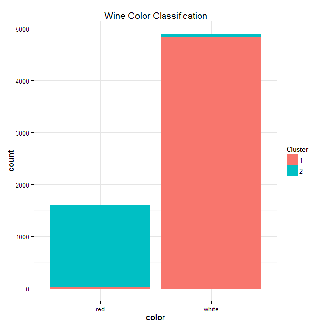
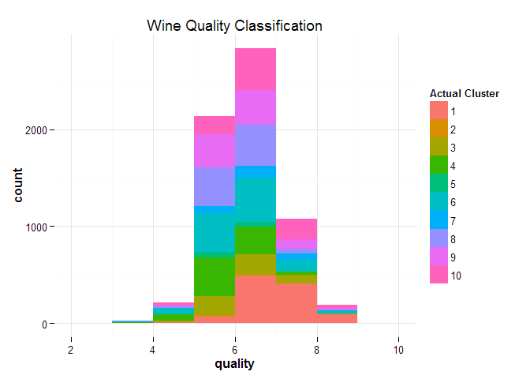

Question 3: Wine
================

Load libraries

    library(ggplot2)
    library(cowplot)

Read in data. Create a separate data frame containing only the chemical
properties. Scale the dataset.

    wine<-read.csv('https://raw.githubusercontent.com/jgscott/STA380/master/data/wine.csv',row.names<-1)
    wine_adj<-wine[,c(1:11)]
    wine_adj_s<-scale(wine_adj,center=TRUE,scale=TRUE)

### Using clustering to find color

Set seed.

    set.seed(78705)

Run k-means. Use two centers because we expect two clusters: a red
cluster and a white cluster.

    wcl<- kmeans(wine_adj_s, centers=2, nstart=50)

Create a plot to examine the accuracy of the k-means model. We see that
cluster 2 largely maps to red wines and that cluster 1 largely maps to
white wines. K-means accuracy appears to be far better than PCA.

    ggplot (aes(x=color, fill=factor(wcl$cluster)), data=wine)+
    geom_bar(position="stack") +
    theme_minimal() +
    ggtitle ('Wine Color Classification') +
    scale_fill_discrete ("Cluster")

Create a confusion matrix and a proportion table. This model accurately
predicts color 98% of the time.

    t1 = xtabs(~wine$color + wcl$cluster)
    t1

    ##           wcl$cluster
    ## wine$color    1    2
    ##      red     24 1575
    ##      white 4830   68

    prop.table(t1,margin=1)

    ##           wcl$cluster
    ## wine$color          1          2
    ##      red   0.01500938 0.98499062
    ##      white 0.98611678 0.01388322

### Final Model Choice:

K-means clustering appears to be a far superior method for determining
whether a wine is red or white from its chemical properties.

### Clustering to find quality

Set seed.

    set.seed(78705)

Run k-means.

Create a plot to examine the accuracy of the k-means model. We see that
k-means is not capable of accurately predicting quality: It predicts a
variety of qualities for each actual quality.

    ggplot (aes(x=quality, fill=factor(wclq$cluster)), data=wine)+
    geom_bar(position="stack", binwidth=1) + theme_minimal() +
    ggtitle ('Wine Quality Classification') +
    scale_fill_discrete ("Actual Cluster")

### Summary

Although K-means clustering is highly capable of determining wine color, it is a very poor discriminant of quality.
